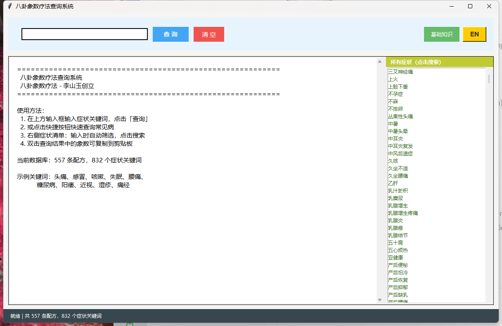

# 八卦象数疗法查询系统 / Bagua Xiangshu Therapy Query System

[English version below ↓](#english-version)

---

## 中文版

这是一个基于李山玉创立的八卦象数疗法的交互式查询程序，提供 CLI 和 GUI 两种使用方式。

### 功能特点

- **CLI 版本** (`xiangshu.py`)：命令行交互，适合快速查询
- **GUI 版本** (`xiangshu_gui_bilingual.py`)：图形界面，支持中英文切换
- **数据独立** (`xiangshu_data.py` / `xiangshu_data_en.py`)：配方数据与程序分离，便于维护和扩展
- **丰富数据**：包含 557 条配方，覆盖 832 个症状关键词
- **实时筛选**：输入症状时，右侧症状列表实时筛选，点击即搜
- **双击复制**：查询结果中的象数可双击复制到剪贴板

### 截图预览

#### GUI 版本（中文）


### 使用方法

#### CLI 版本
```bash
python xiangshu.py
```

#### GUI 版本（双语，推荐）
```bash
python xiangshu_gui_bilingual.py
```

#### GUI 版本（中文仅）
```bash
python xiangshu_gui.py
```

#### GUI 版本（英文仅）
```bash
python xiangshu_en.py
```

### 文件说明

| 文件 | 说明 |
|------|------|
| `xiangshu_data.py` | 配方数据文件（中文，557 条配方，832 个症状关键词） |
| `xiangshu_data_en.py` | 配方数据文件（英文，557 条配方，832 个症状关键词） |
| `xiangshu.py` | CLI 版本主程序（中英文启动器） |
| `xiangshu_en.py` | CLI 英文版本主程序 |
| `xiangshu_gui.py` | GUI 中文版本主程序（tkinter） |
| `xiangshu_gui_bilingual.py` | GUI 双语版本主程序（右上角 EN/中 切换） |
| `README.md` | 本文件 |
| `README_en.md` | 英文文档 |

### 数据来源

配方数据来源于网络搜索和公开资料，包括：
- 李山玉《八卦象数疗法》相关文献
- 微博、豆瓣等社交平台的用户分享
- 中医养生类网站的公开配方

### 注意事项

1. 本疗法为辅助调理，**不能替代正规医疗**。
2. 急重症请**立即就医**。
3. 孕妇、严重心脏病患者请在专业人士指导下使用。
4. 象数疗法需要坚持使用，效果因人而异。

### 八卦象数疗法简介

八卦象数疗法是李山玉创立的一种自然疗法，通过默念或贴敷特定数字组合（象数）来调理身体。

八卦对应数字：
- **1** — 乾卦 — 头、脑、督脉、大肠
- **2** — 兑卦 — 肺、鼻、咽喉、皮肤
- **3** — 离卦 — 心、目、血、舌
- **4** — 震卦 — 肝、胆、筋、四肢
- **5** — 巽卦 — 胆、股、疏风、安神
- **6** — 坎卦 — 肾、耳、膀胱、骨、生殖
- **7** — 艮卦 — 胃、背、鼻、止痛、止
- **8** — 坤卦 — 脾、腹、肌肉、消化

使用方法：
1. **默念法**：安静状态下，心中默念象数，如 `640·70`，每次15-30分钟，每日2-3次。
2. **贴敷法**：将象数写在胶布上，贴于相应穴位。
3. **顺序**：按配方中的顺序默念，·代表短暂停顿。

### 贡献

欢迎提交 Pull Request 或 Issue 来补充配方数据或改进程序功能。

### 许可证

MIT License

---

<br>

# English Version

An interactive query system for Bagua Xiangshu Therapy (八卦象数疗法), founded by Li Shanyu. Provides both CLI and GUI interfaces.

### Features

- **CLI version** (`xiangshu.py`): Command-line interface for quick queries
- **GUI version** (`xiangshu_gui_bilingual.py`): Graphical interface with Chinese/English toggle
- **Separated data** (`xiangshu_data.py` / `xiangshu_data_en.py`): Formula data separated from code for easy maintenance
- **Rich database**: 557 formulas covering 832 symptom keywords
- **Real-time filtering**: Right-side symptom list filters as you type
- **Double-click to copy**: Copy Xiangshu numbers to clipboard with double-click

### Screenshots

#### GUI Version (Chinese)


### Usage

#### CLI Version
```bash
python xiangshu.py
```

#### GUI Version (Bilingual, Recommended)
```bash
python xiangshu_gui_bilingual.py
```

#### GUI Version (Chinese Only)
```bash
python xiangshu_gui.py
```

#### GUI Version (English Only)
```bash
python xiangshu_en.py
```

### File Description

| File | Description |
|------|-------------|
| `xiangshu_data.py` | Formula data file (Chinese, 557 formulas, 832 symptom keywords) |
| `xiangshu_data_en.py` | Formula data file (English, 557 formulas, 832 symptom keywords) |
| `xiangshu.py` | CLI main program (Chinese/English launcher) |
| `xiangshu_en.py` | CLI English version main program |
| `xiangshu_gui.py` | GUI Chinese version main program (tkinter) |
| `xiangshu_gui_bilingual.py` | GUI Bilingual version main program (EN/中 toggle in top-right) |
| `README.md` | This file |
| `README_en.md` | English documentation |

### Data Sources

Formula data sourced from online searches and public resources:
- Li Shanyu's "Bagua Xiangshu Therapy" literature
- User shares on Weibo, Douban, and other social platforms
- Public formulas from TCM and wellness websites

### Important Notes

1. This therapy is a **complementary approach, NOT a substitute for professional medical treatment**.
2. For **emergencies or severe symptoms, seek immediate medical attention**.
3. Pregnant women and patients with serious heart conditions should consult professionals before use.
4. Consistent practice is required; results vary by individual.

### Introduction to Bagua Xiangshu Therapy

Bagua Xiangshu Therapy is a natural healing method founded by Li Shanyu. It uses specific number combinations (Xiangshu) recited mentally or applied topically to balance the body's energy.

Bagua Number Correspondences:
- **1** — Qian — Head, brain, Du meridian, large intestine
- **2** — Dui — Lungs, nose, throat, skin
- **3** — Li — Heart, eyes, blood, tongue
- **4** — Zhen — Liver, gallbladder, tendons, limbs
- **5** — Xun — Gallbladder, thighs, wind-dispelling, calming
- **6** — Kan — Kidneys, ears, bladder, bones, reproduction
- **7** — Gen — Stomach, back, nose, pain relief, stopping
- **8** — Kun — Spleen, abdomen, muscles, digestion

How to Use:
1. **Mental Recitation**: In a quiet state, recite the numbers mentally, e.g., `640·70`, 15-30 minutes each session, 2-3 times daily.
2. **Topical Application**: Write the numbers on adhesive tape and apply to corresponding acupoints.
3. **Order**: Recite in the order given in the formula; `·` indicates a brief pause.

### Contributing

Pull Requests and Issues are welcome to contribute formulas or improve the program.

### License

MIT License
